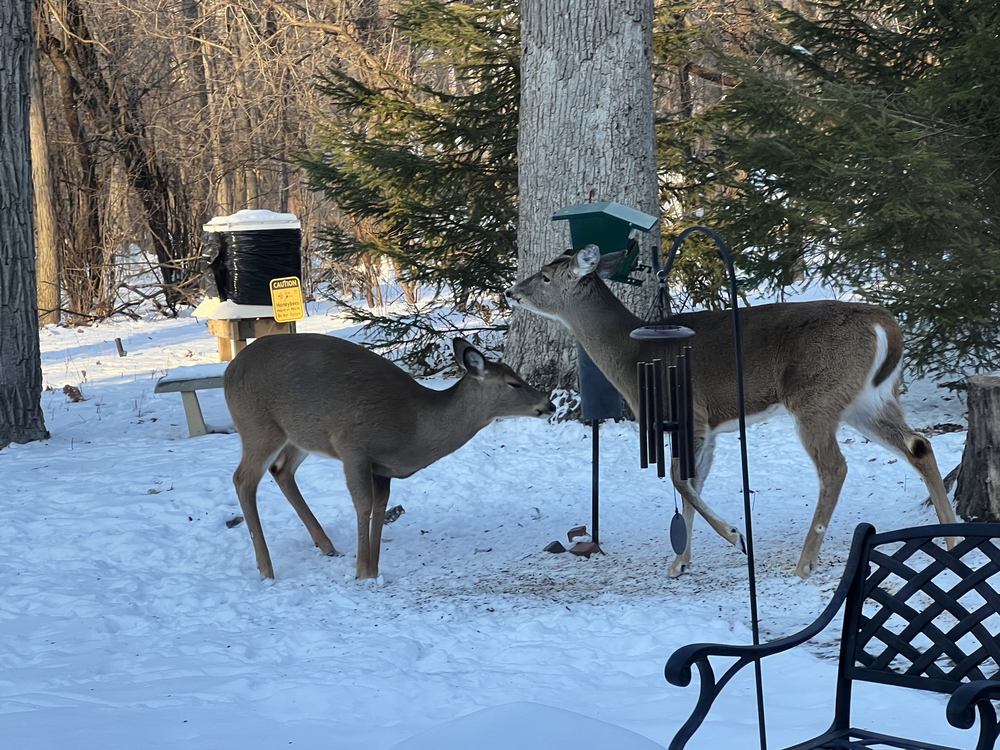

# Deer Detector Project

Is it a bird feeder, or a squirrel feeder or a deer feeder?

In this project I wanted to create and end-to-end solution to detect when deer were at the bird feeder, because after the deer are done - there is very little food for the birds.




## Overview

This project will cover all of the steps to create the 'Deer Detector'.  Specifically this project will cover:

* [Step 1] Downloading a dataset of Deer images and Landscape images from Kaggle
* [Step 2] Create a script to currate a train/validation/test dataset of the Kaggle images
* [Step 3] Use the Keras DataSet API to create the train/validation/test dataset instances used in training.  Including resizing images and scaling the image data.
* [Step 3] Use feature extraction transfer learning to train a Keras model to detect Deer
* [Step 4] Evaluate the model on the test dataset from Kaggle, but also on 'production' images from my backyard
* [Step 5] Using captured video, process each video frame to detect the presence of deer

### Bonus
As a bonus, we will look at how to convert the model to the OpenVINO format and run the model on the OpenCV AI Kit.

This folder will contain my work to create a dataset and model to detect deer.  This project will classify image as having a deer or being background.

This is not object detection, and it is similar to Dog-vs-Cat or Mask-NoMask classification. However

## Step 1 - Downloading a dataset of Deer and Landscape images from Kaggle

Download the datasets from Kaggle. You will need a free account to download the datasets.

These datasets have already been downloaded and are part of this repo.

You can find them in the directories:

```shell
ls datasets/kaggle/deer
ls datasets/kaggle/landscape
```

### Kaggle Deer Image Dataset

[Kaggle](https://www.kaggle.com/faisalakhtar/images-of-deer-for-svm-classifier)

### Kaggle Landscape Image Dataset

[Kaggle](https://www.kaggle.com/arnaud58/landscape-pictures)

## Step 2 - Create a script to generate a train/validation/test dataset 

See script:
```text
make_datasets.py
```

## Step 3 - Create datasets and transfer learning model

See script:
```text
model_train.py
```

## Step 4 - Evaluate the model on the testing data

See script:
```text
evaluate_model.py
```

There are two datasets to evaluate the model.

The `./datasets/model/test` represent images from the Kaggle dataset that have been held out and not used in the training process.  This should provide a good indication of how the model generalizes to images from the dataset that the model has never seen.

The `./dataets/backyard/images` represent images from the actual area that we are trying to predict.  For the purpose of this exercise, I specifically excluded images from the actual environment that I want to predict in.  Normally you would not do this, but I was curious to see how the model would behave having never seen images from the actual 'production' site.

To run the evaluation, execute one of the command lines below.

```shell
python evaluate_model.py --dataset ./datasets/model/test  --model-dir ./deer_detector_model
python evaluate_model.py --dataset ./datasets/backyard/images  --model-dir ./deer_detector_model
```

For the backyard images, the accuracy was 0.982 with only two images being misclassified out of 111, at the time of this writing. I may add more images at a later date.

## Step 5 - test on a video from the backyard.

To use a test video that brings deer into and out of frame, use the command below.

```shell
python detect_video.py --video-file datasets/backyard/movies/test_deer.MOV
```

## Bonus - OpenCV AI Kit

We will go over the steps necessary

We will need to add three additional libraries:

```shell
pip install openvino-dev
pip install blobconverter
pip install depthai
```

These should be installed as part of the project requirements, but I wanted to point out these libraries as specfic to DepthAI.

### Convert Tensorflow Model to OpenVino IR
https://docs.luxonis.com/en/latest/pages/model_conversion/

This will allow the model to run on OAK Device

See the script: `create_openvino.sh`

```shell
python -m mo --reverse_input_channels --batch 1 --mean_values \[127.5, 127.5, 127.5\] --scale_values \[127.5, 127.5, 127.5\] --saved_model_dir ./mask_detector --output_dir openvino_model
```

After this runs, you should have a directory with an .xml, .bin, .mapping file.  

The .xml and .bin can be used with the [Luxonis Myriad Online Compiler](http://blobconverter.luxonis.com) to create a .blob file

or

```shell
blobconverter --openvino-xml ./openvino_model/saved_model.xml --openvino-bin ./openvino_model/saved_model.bin --shaves 6 --output-dir ./openvino_model --no-cache
```

### Test with Video

To test the setup with the same video used above.  Execute the following:

```shell
python oak_detect_video.py --video-file datasets/backyard/movies/test_deer.MOV
```

Notice how much quicker using the OAK device is than running the model locally.

### Test with OAK-1 Camera

```shell
python oak_detect_camera.py
```

There is a command line option to specify openvino blob model if it is not in the default location


There are command line options for video file path, and model path.

When deployed to the RaspberryPI and setup in the window, the performance was 'pretty good'.  I had to lower the threshold to be 0.4 and it was dependent upon the positioning of the camera.  If I could have zoomed into the target area, or there was better light, I believe the results would have been much better.

Below you can see the setup in the window with a 0.5 threshold.  The first half detects deer at the 0.5 threshold, and the second half does not.  Note the rounding for display.


## Things to keep in mind

### Keras Data Augmentation Layers

We did not use image augementation in this example.  However if we had, there appears to be an issue in TF2.7 with saving models with the experimental preprocessing layers for now. 

See [Keras issue](https://github.com/keras-team/keras/issues/15699).  It looks like there are issues using the preprocessing layers and saving a model.

Use `ImageDataGenerator` for the time being.

https://keras.io/api/layers/preprocessing_layers/

https://keras.io/api/layers/preprocessing_layers/image_augmentation/

### Running on a Raspberry PI

Be sure to run the following commands for the RPI to detect the camera:

```shell
echo 'SUBSYSTEM=="usb", ATTRS{idVendor}=="03e7", MODE="0666"' | sudo tee /etc/udev/rules.d/80-movidius.rules
sudo udevadm control --reload-rules && sudo udevadm trigger
```